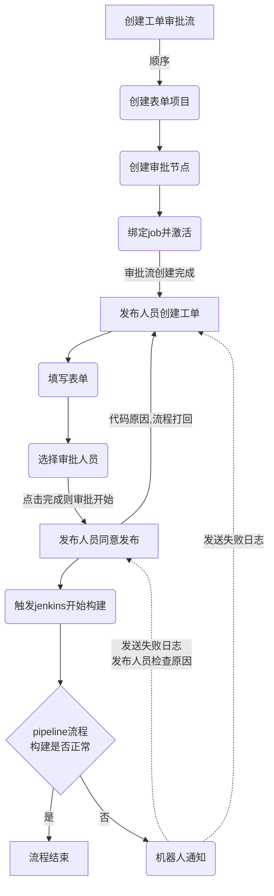

# 1. ITSM设计流程
- 需要安装插件名称: Markdown Preview Mermaid Support
## 1. 使用流程

```mermaid
flowchart TD
A[创建工单审批流] -->|顺序| B(创建表单项目)
B --> C(创建审批节点)
C --> D(绑定job并激活)
D -->|审批流创建完成| E[发布人员创建工单]
E --> F(填写表单)
F --> G(选择审批人员)
G -->|点击完成则审批开始| H[发布人员同意发布]
H --> I(触发jenkins开始构建)
I --> J{pipeline流程\n构建是否正常}
J -->|是| L[流程结束]
J -->|否| M(机器人通知)
M -.发送失败日志\n发布人员检查原因.-> H
H -->|代码原因,流程打回| E
M -.发送失败日志.-> E
```