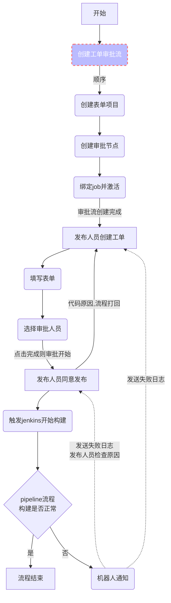

# 1. ITSM设计流程
- 需要安装插件名称: Markdown Preview Mermaid Support
## 0. 进度状态
1. 进行中
    - style B fill:#bbf,stroke:#f66,stroke-width:2px,color:#fff,stroke-dasharray: 5 5
2. 已完成
    - style A fill:#090,stroke:099,stroke-width:2px
## 1. 使用流程

## 2. 创建工单审批流开发
### 1. 基础信息
1. req
```json
{
    "approval_name": "test",
    "approval_code": "xxx",
    "job_name": "dev",
    "descriptions": "describe ...",
}
```
2. 表单设计
3. 流程设计
4. 激活启用
